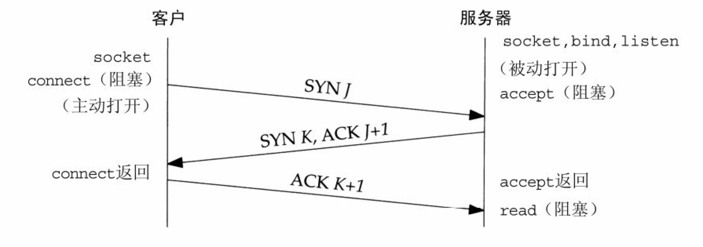
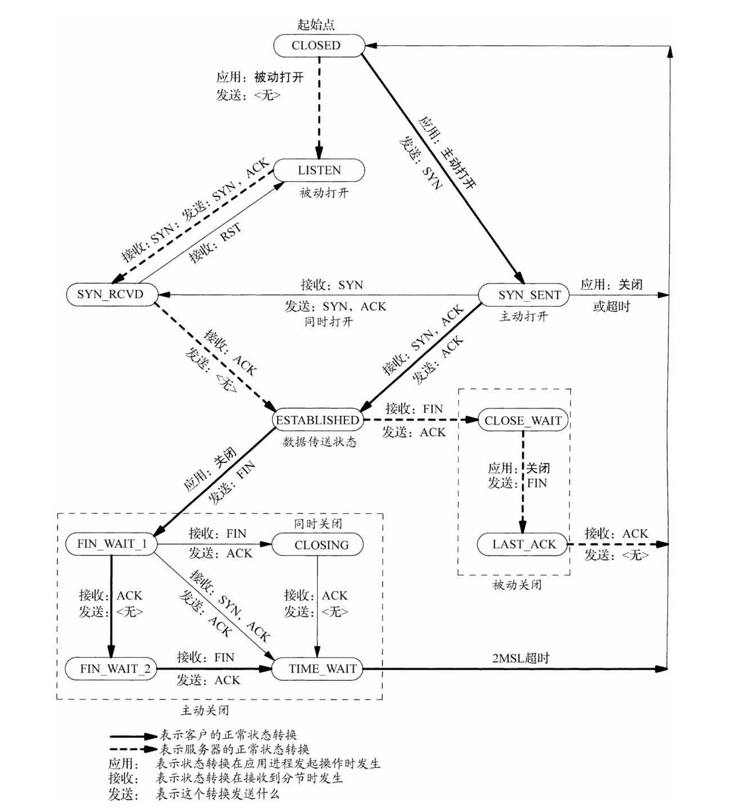
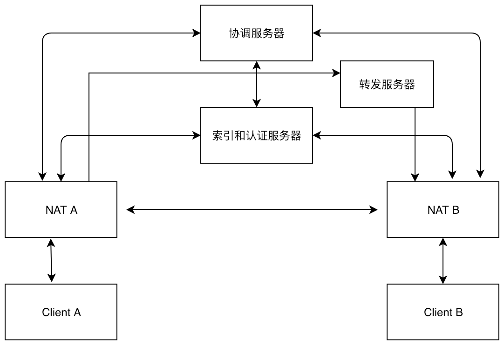

# 对等网络-P2P

## 1.NAT (Network Address Translation)

### 1.1 NET类型
#### 用语定义:

Tuple表示一个ip地址和端口（port）的二元组

- 内部Tuple
内部主机私有地址和端口构成的二元组，即发送报完内部主机的源ip地址和端口构成的二元组
- 外部Tuple
指内部Tuple经过NAT网络地址转换后，所获得的外部地址和端口的二元组，即外部目标主机收到报文时所看到的报文的源ip地址和端口
- 目标Tuple
目标主机ip地址和端口所构成的二元组

#### 圆锥形NAT (Cone NAT)
- 全圆锥形(Full Cone NAT)
所有来自同一 个内部Tuple X的请求均被NAT转换至同一个外部Tuple Y，而不管这些请求是不是属于同一个应用或者是多个应用的。除此之外，当X-Y的转换关系建立之后，任意外部主机均可随时将Y中的地址和端口作为目标地址 和目标端口，向内部主机发送UDP报文，由于对外部请求的来源无任何限制，因此这种方式虽然足够简单，但却不那么安全
- 限制圆锥形(Restricted Cone NAT)
它是Full Cone的受限版本：所有来自同一个内部Tuple X的请求均被NAT转换至同一个外部Tuple Y，只有当内部主机曾经发送过报文给外部主机（假设其IP地址为Z）后，外部主机才能以Y中的信息作为目标地址和目标端口，向内部 主机发送UDP请求报文，这意味着，NAT设备只向内转发（目标地址/端口转换）那些来自于当前已知的外部主机的UDP报文，从而保障了外部请求来源的安 全性
- 端口限制圆锥形(Port Restricted Cone NAT)
  它是Restricted Cone NAT的进一步受限版。只有当内部主机曾经发送过报文给外部主机（假设其IP地址为Z且端口为P）之后，外部主机才能以Y中的信息作为目标地址和目标端 口，向内部主机发送UDP报文，同时，其请求报文的源端口必须为P，这一要求进一步强化了对外部报文请求来源的限制，从而较Restrictd Cone更具安全性

```
              Service A(155.99.25.11:62000)   Service B(158.100.25.12:6532)
                         |
                        NAT
                  138.76.29.7:6666
                          |
                          |
   +----------------------+----------------------+
   |                      |                      |
 Client A               Client B             Client C
10.0.0.1:1234          10.0.0.1:1234       10.0.0.1:1234
```

#### 对称形NAT(Symmetric NAT)
在Symmetric NAT中，目标Tuple则成为了NAT设备建立转换关系的一个重要考量：只有来自于同一个内部Tuple 、且针对同一目标Tuple的请求才被NAT转换至同一个外部Tuple，否则的话，NAT将为之分配一个新的外部Tuple。

```
   Server1                                          Server2
138.76.29.7:6666                              156.99.25.18:8900
   |                                                  |
   +-------------------------+------------------------+
                             |
                   A-S1 155.99.25.11:62000
                   A-S2 155.99.25.11:62001
                       Symmetric NAT
                             |
                          Client A
                        10.0.0.1:1234
```


#### NAT类型检测
- 检查是否能进行UDP通信
 Client向Server1发起请求，超时时间设置为300ms,如果超时没有收到Server1的回包，则认为不能进行UDP通信，可能原因防火墙或者NAT阻值UDP通信。
- 判断是否是公网IP(没有经过NAT设备)
 Client向Server1发起请求，Server1回复Client的外部Tuple,客户端对比自己的内部Tuple,如果外部Tuple和内部Tuple相同，说明Client不在NAT之后，这样的客户端具有公网IP,可直接进行通信。
- 判断Full Cone NAT
 Client向Server1发起请求，Server3回复Client的请求报文，此时如果Client能成功收到Server3的请求报文，说明Client 处于Full Cone NAT之后
- 判断Symmetric NAT
Client分别向Server1和Server3发起请求报文，Server1和Server3回复Client的外部Tuple1和Tuple2,如果Tuple1和Tuple相同，则是Symmetric NAT
- 判断Restricted NAT
- 判断Port Restricted Cone NAT
Client向Server1发起请求报文，Server2回复Client,如果Client能收到Server2的回复报文，则Client处于Restricted NAT之后，否则处于Port Restricted Cone NAT
```
   Server1              Server2                     Server3
138.76.29.7:6666     138.76.29.7:6667           156.99.25.18:8900
   |                         |                        |
   +-------------------------+------------------------+
                             |
                            NAT ?
                             |
                           Client
                        10.0.0.1:1234
```

## 2.NAT穿透
### 2.1 转发
```
                          Server                    
                     138.76.29.7:6667           
                             |                        
   +-------------------------+------------------------+
   |                                                  |
  NAT A                                              NAT B
 138.79.89.57:6689                              156.99.25.18:8900
   |                                                  |
 Client A                                          Client B
10.0.0.1:1234                                    192.168.1.8:2345
```
### 2.2 反向链接
```
                          Server                   
                     138.76.29.7:6667           
                             |                        
   +-------------------------+------------------------+
   |                                                  |
  NAT A                                            Client B
 138.79.89.57:6689                              156.99.25.18:8900
   |
 Client A
10.0.0.1:1234  
```
### 2.3 UDP打洞
#### 2.3.1 一般打洞为什么不使用TCP协议
```
	这里有一种方法能够在某种情况下建立一个穿透NAT的端对端TCP直连.我们知道,绝大多数的TCP会话的建立,都是通过一端先发送一个SYN包开始,另一方则回发一个SYN-ACK包的过程.然而,这里确实存在另外一种情况,就是P2P的双方各自同时地发出一个SYN包到对方的公网地址上,然后各自都单独地返回一个ACK响应来建立一个TCP会话.这个过程被称之为"Simultaneous open"(同时开放连接).
	
	如果一个NAT接收到一个来自私有网络外面的TCP SYN包,这个包想发起一个"引入"的TCP连接,一般来说,NAT会拒绝这个连接请求并扔掉这个SYN 包,或者回送一个TCP RST(connection reset,重建连接)包给请求方.但是,有一种情况,当这个接收到的SYN包中的源IP地址和端口,目标IP地址和端口都与NAT登记的一个已经激活的TCP会话中的地址信息相符时,NAT将会放行这个SYN 包,让它进入NAT内部.特别要指出,如果NAT恰好看到一个刚刚发送出去的一个SYN包也和上面接收到的SYN包中的地址信息相符合的话,那么NAT将会认为这个TCP连接已经被激活,并将允许这个方向的SYN包进入NAT内部.
	
	如果Client A和Client B能够彼此正确的预知对方的NAT将会给下一个TCP连接分配的公网TCP端口,并且两个客户端能够同时地发起一个"外出"的TCP连接,并在对方的SYN包到达之前,自己刚发送出去的SYN包都能顺利的穿过自己的NAT的话,一条端对端的TCP连接就成功地建立了.
```




#### 2.3.2 处于不同NAT之后的客户端通信
```
                          Server                    
                     138.76.29.7:6667           
                             |                        
   +-------------------------+------------------------+
   |                                                  |
  NAT A                                              NAT B
 138.79.89.57:6689                              156.99.25.18:8900
   |                                                  |
 Client A                                          Client B
10.0.0.1:1234                                    192.168.1.8:2345
```

#### 2.3.3 处于相同同NAT之后的客户端通信
```
                          Server                   
                     138.76.29.7:6667           
                             | 
                            NAT
                      A-S 138.79.89.57:6680
                      B-S 138.79.89.57:6681
                             |
   +-------------------------+------------------------+
   |                                                  |
 Client A                                          Client B
10.0.0.1:1234                                    192.168.1.8:2345
```

#### 2.3.4 处于多层NAT之后的客户端通信
```
                          Server                    
                     138.76.29.7:6667           
                             |
                            NAT
                     A-S 138.79.89.57:6689
                     B-S 138.79.89.57:6690
                             |
   +-------------------------+------------------------+
   |                                                  |
  NAT A                                              NAT B
 192.168.32.86:8798                             192.168.3.34:8788
   |                                                  |
 Client A                                          Client B
10.0.0.1:1234                                    192.168.1.8:2345
```
#### 2.3.5 对称NAT之后的客户端通信
```
                          Server                    
                     138.76.29.7:6667           
                             |                        
   +-------------------------+------------------------+
   |                                                  |
  NAT A                                              NAT B
 A-S 138.79.89.57:6689                           B-S 156.99.25.18:8900
 A-B 138.79.89.57:?                              B-A 138.79.89.57:?
   |                                                  |
 Client A                                          Client B
10.0.0.1:1234                                    192.168.1.8:2345
```
#### 使用UPNP增强打洞成功率

- 简介：

  **通用即插即用**（英语：Universal Plug and Play，简称**UPnP**）是由“通用即插即用论坛”（UPnP™ Forum）推广的一套网络协议。该协议的目标是使家庭网络（数据共享、通信和娱乐）和公司网络中的各种设备能够相互无缝连接，并简化相关网络的实现。UPnP通过定义和发布基于开放、因特网通讯网协议标准的UPnP设备控制协议来实现这一目标。

  UPnP为NAT穿透带来了一个解决方案。NAT穿透允许UPnP数据包在没有用户交互的情况下，无障碍的通过路由器或者防火墙（假如那个路由器或者防火墙支持NAT）

  [LibUpnp](http://pupnp.sourceforge.net/)

  [miniUpbp](http://miniupnp.free.fr/)

## 3.P2P
### 3.1 P2P设计


### 3.2 服务器
- UDP服务器IP路由表 (改变系统内核参数，增大ip路由表容量，同时减小路由表清理时间)
- UDP切包问题
### 3.3客户端
- 做种子文件，分块验证，分块上传和分块下载
- 检查上传数据的合法性
- utp,kcp,原生udp协议，进行通信
- 使用upnp做端口映射
### 3.3 使用p2p做文件传输效果
- 穿透成功率76%左右，上行流量限制25k,p2p流量可以占到总流量的30%。